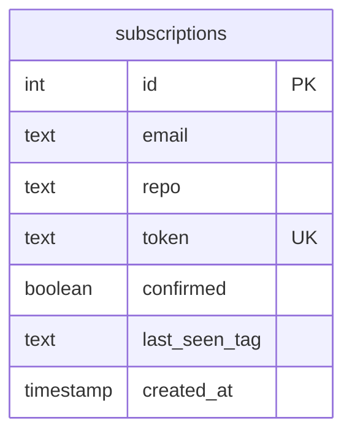

# ADR-0003: Вибір бази даних для постійного зберігання даних

**Статус:** Прийнято

**Дата:** 2026-05-09

**Автор:** Oleh Buriachok

## Контекст

Потрібно обрати сховище даних для застосунку, який дозволяє користувачам підписуватись на email-сповіщення про нові релізи GitHub-репозиторіїв.

Застосунок має зберігати email користувача, репозиторій, токен для підтвердження підписки або відписки, статус підтвердження та службові дані для відстеження останнього релізу. Ці дані мають зберігатися після перезапуску застосунку.

Також сховище має допомагати уникати дублікатів: один користувач не повинен мати дві однакові підписки на той самий репозиторій.

## Розглянуті варіанти

1. **PostgreSQL**
   - **Плюси:** повноцінні ACID-транзакції, консистентність даних, зручні унікальні обмеження та індекси, добре підходить для структурованих даних, знайомий стек.
   - **Мінуси:** потребує окремого інстансу БД, потребує більше ресурсів, локальний запуск і конфігурація складніші, зміни схеми потребують міграцій.

2. **MongoDB**
   - **Плюси:** зручна для JSON-подібних документів, гнучка документна модель, хороша інтеграція з Node.js, добре підходить для менш формалізованих або вкладених об’єктів.
   - **Мінуси:** потрібно контролювати структуру документів на рівні застосунку, складніше забезпечувати консистентність, зв’язки між колекціями потребують додаткової логіки.

3. **SQLite**
   - **Плюси:** проста в налаштуванні, не потребує окремого сервера, підтримує SQL, транзакції та унікальні обмеження.
   - **Мінуси:** менш зручна для production-like API-сервісу, складно масштабувати.

## Прийняте рішення

Обрано **PostgreSQL** як основну базу даних застосунку.

PostgreSQL підходить для проєкту, бо дані мають чітку структуру, а система потребує надійних обмежень унікальності. Також це знайомий стек, що спрощує реалізацію та підтримку.

**Схема бази даних:**

`id` є первинним ключем. `token` має бути унікальним, бо використовується для підтвердження підписки та відписки. Пара `email + repo` також має бути унікальною, щоб не створювати дублікати підписок.

`confirmed` показує, чи підтверджена підписка. `last_seen_tag` зберігає останній відомий реліз, щоб не надсилати повторні повідомлення. `created_at` зберігає час створення підписки.

## Наслідки

**Позитивні:**

- Унікальність `token` та пари `email + repo` контролюється на рівні БД.
- PostgreSQL підтримує транзакції, індекси та обмеження цілісності.
- Структура даних є чіткою та контрольованою через схему БД.
- Знайомий стек спрощує розробку та підтримку.

**Негативні:**

- Зміни схеми потребують міграцій.
- PostgreSQL потребує більше ресурсів, ніж простіші рішення.
