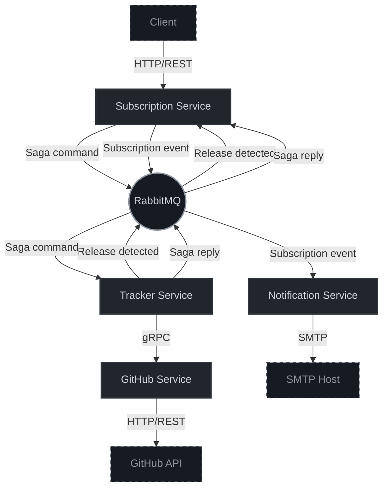
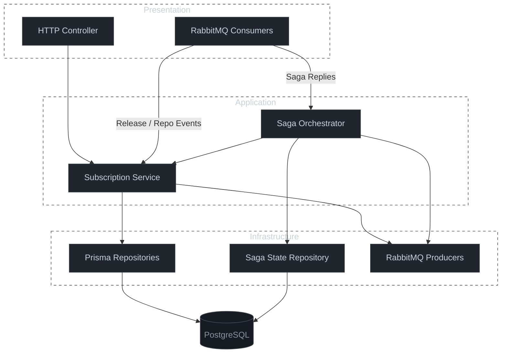
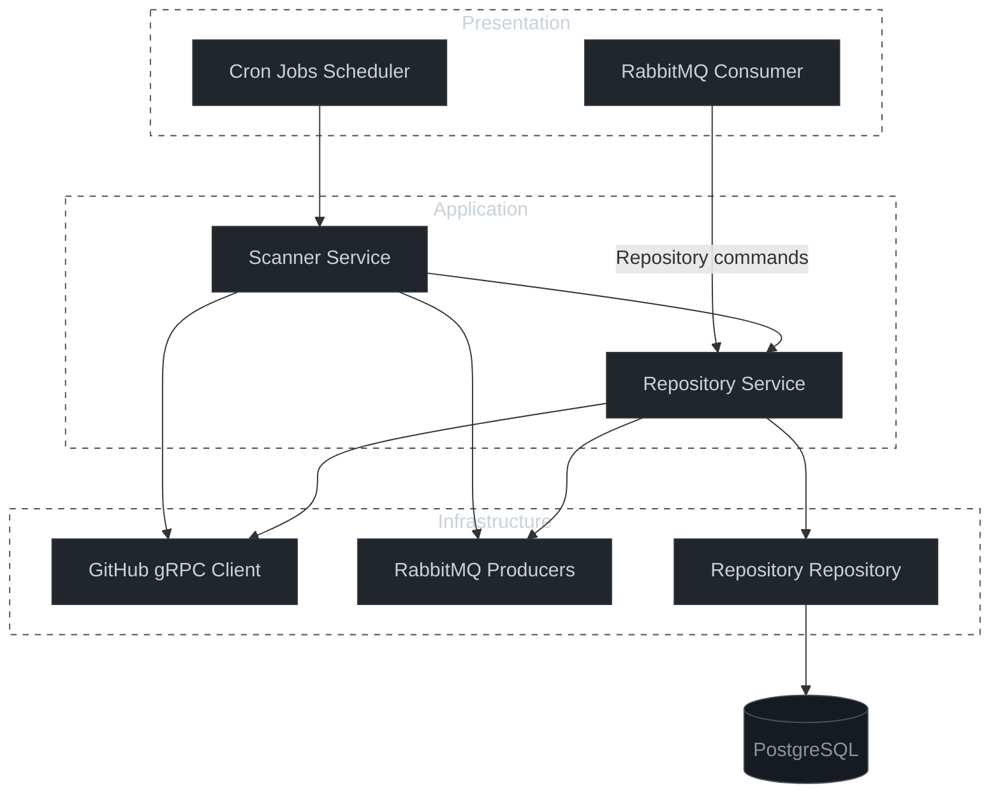
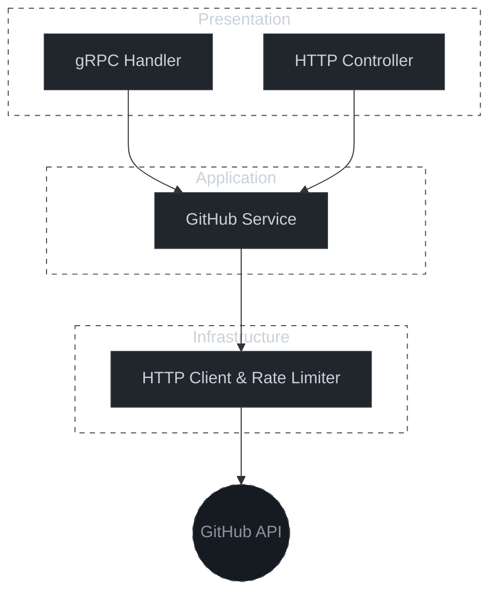
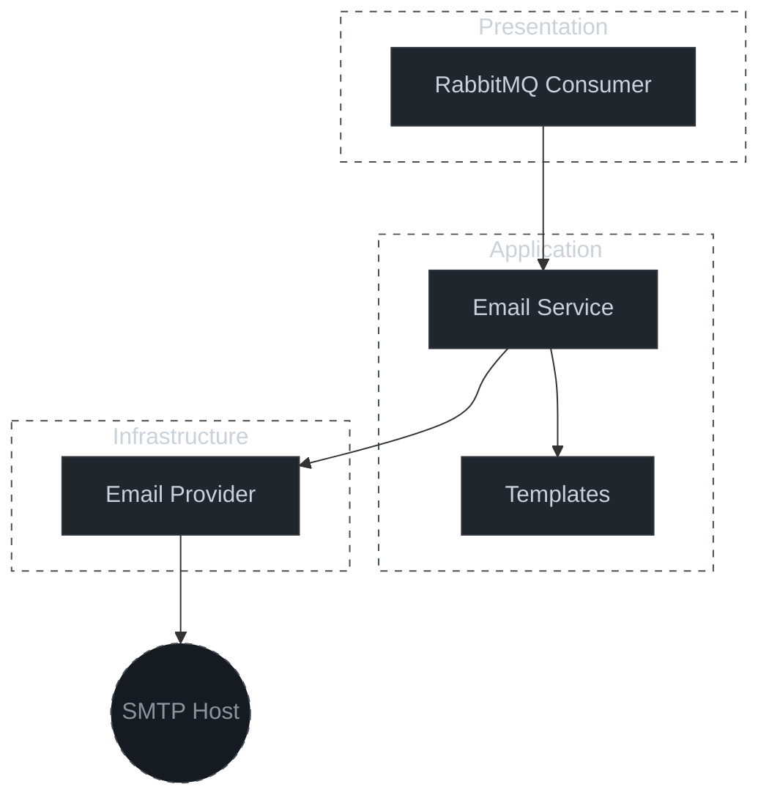

# GitHub Release Subscription API Architecture

This document provides a high-level architectural overview of the GitHub Release Subscription API system. It outlines the service boundaries, communication protocols, and internal component flows that enable users to subscribe to repository releases and receive automated notifications.

## High-Level System Design

The system consists of a main entry point and three dedicated microservices:

- **Core Subscription Service:** The main entry point that exposes user-facing APIs, manages subscription lifecycles, and coordinates sagas.
- **GitHub Service:** Handles all direct interactions with the GitHub API for repository validation and data fetching.
- **Tracker Service:** Periodically scans tracked repositories for new releases and publishes discovery events.
- **Notification Service:** Renders email templates and delivers user notifications via SMTP.

---

## System Architecture

The following diagram illustrates how the four primary services interact with each other and cross external network boundaries using HTTP, gRPC, and RabbitMQ.

---

## Component-Level Service Architecture

### 1. Core Subscription Service

Exposes the public REST API, orchestrates multi-service subscription lifecycles using the Saga pattern, and processes incoming system events via decoupled consumers.

### 2. Tracker Service

An autonomous tracking module triggered by background cron schedules to scan repository updates, validate against the GitHub adapter, and broadcast discovered mutations.

### 3. GitHub Service

Acts as a stateless, synchronous proxy isolation layer that abstracts the rate-limited external GitHub API endpoints away from internal callers.

### 4. Notification Service

An asynchronous worker designed exclusively for template rendering and reliable end-user email distribution without side effects or persistence layers.

