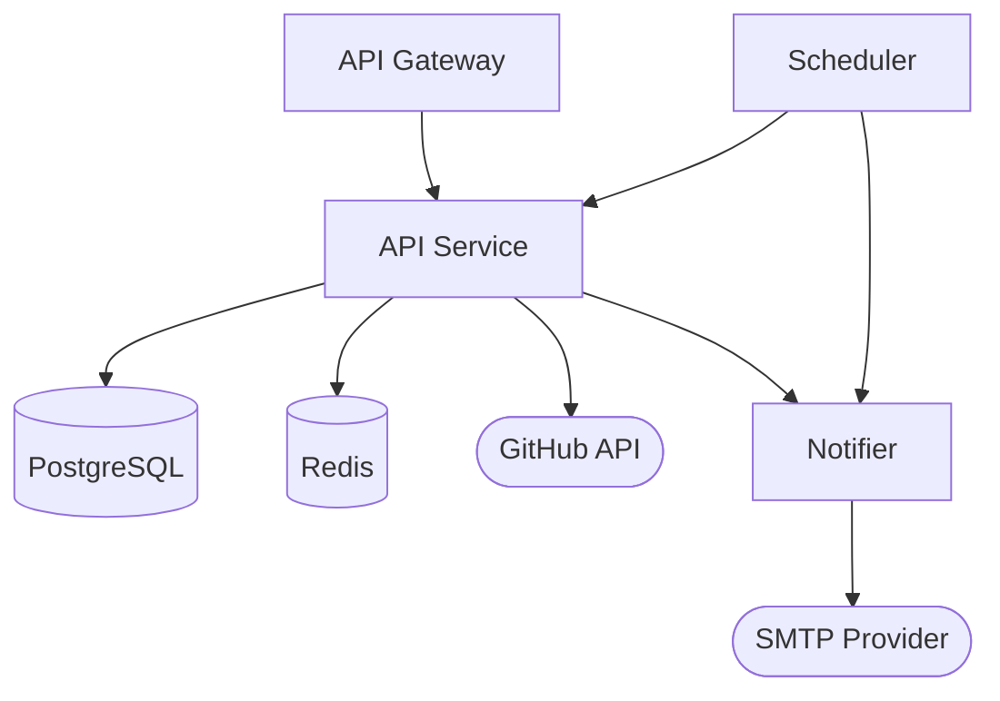
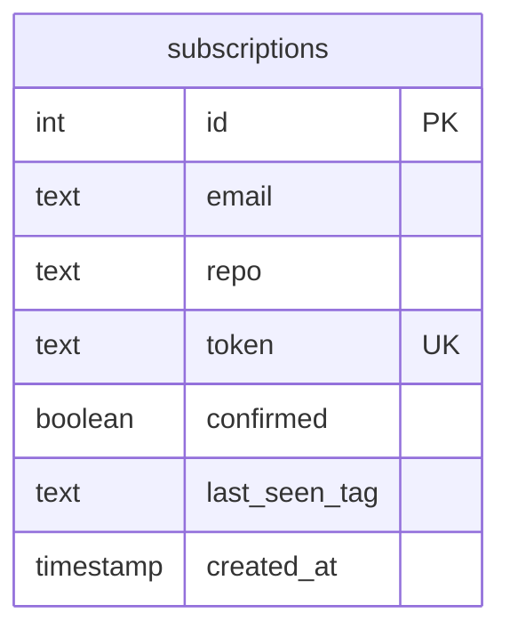
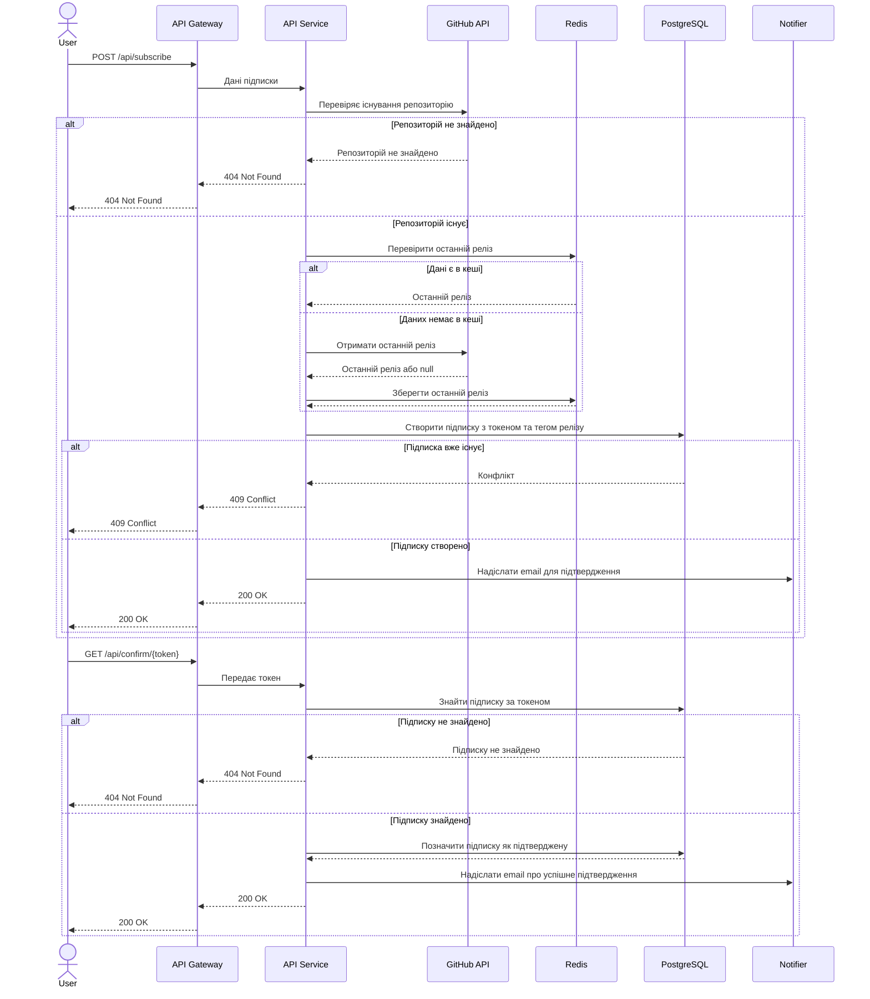
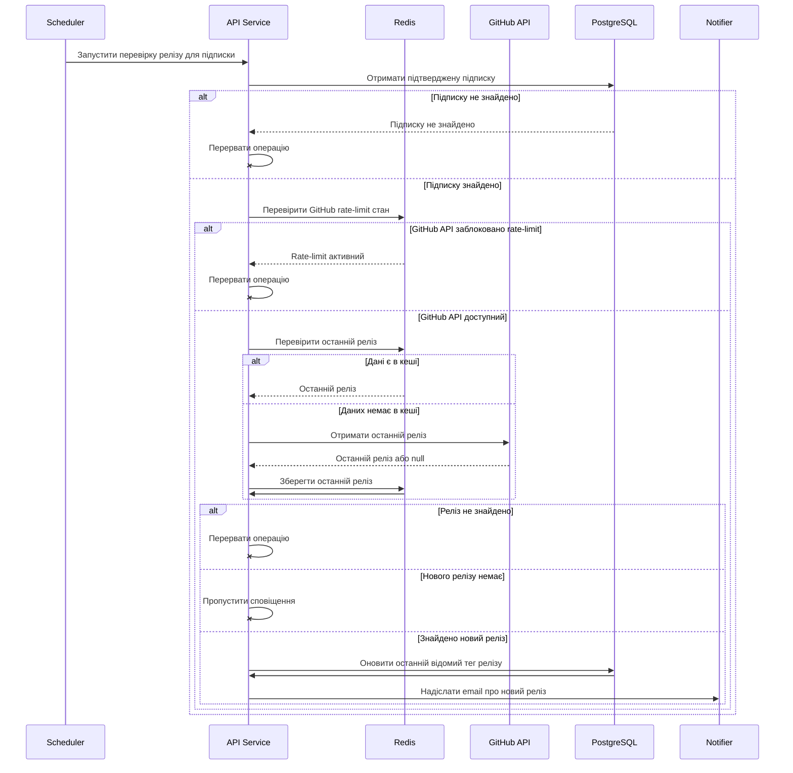
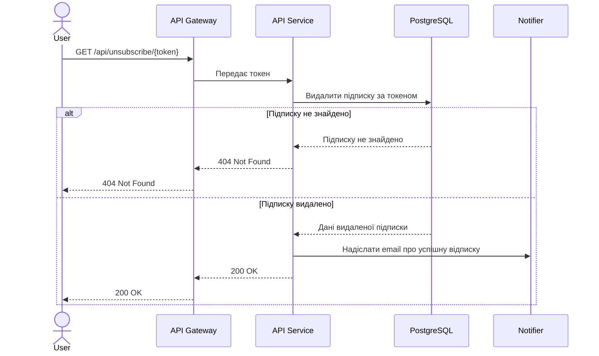
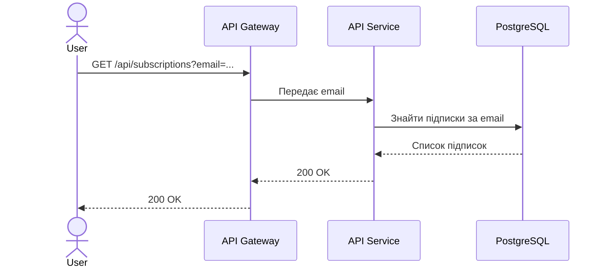

# System Design: GitHub Release Subscription API

## 1. Вимоги до системи

### Функціональні вимоги

- Користувач може підписатись на сповіщення про нові релізи у існуючому GitHub-репозиторії.
- Користувач може отримати список своїх підписок за email.
- Система надсилає email з посиланнями для підтвердження та скасування підписки.
- Система періодично перевіряє нові релізи GitHub-репозиторіїв.
- Система надсилає email-сповіщення про нові релізи.
- Система видаляє непідтверджені підписки.

### Нефункціональні вимоги

- **Availability:** uptime не нижче 99%.
- **Reliability:** система коректно обробляє тимчасову недоступність зовнішніх сервісів та не
  втрачає дані користувачів.
- **Performance:** затримка API-відповіді не повинна перевищувати 250 ms (за винятком випадків із
  запитами до GitHub API).
- **Scalability:** система проєктується з розрахунком вертикальне на горизонтальне масштабування (з переходом до мікросервісної архітектури).
- **Security:** токени підтвердження та відписки є унікальними й непередбачуваними.
- **Maintainability:** код розділений за відповідальностями.
- **Observability:** логування (стек **ELK**) та моніторинг (**Prometheus + Grafana**).
- **Integrability:** система надає OpenAPI-документацію.

### Обмеження

- GitHub API має rate limit: 5 000 запитів/годину з токеном автентифікації або 60 запитів/годину без
  токена.
- Email-доставка залежить від зовнішнього SMTP-провайдера.
- Система має працювати на мінімальній інфраструктурі через обмежений бюджет.

---

## 2. Оцінка навантаження

### Користувачі

- Активні користувачі: до 1 000.
- Середня кількість підписок на користувача: 3.
- Орієнтовна кількість підписок: до 3 000.
- Пікове навантаження API: 20–50 HTTP-запитів/с.
- Background scan: кожні 10 хвилин.
- Відправка повідомлень: орієнтовно до 1 500 на день (залежить від кількості нових релізів).

### Дані

- Розмір однієї підписки: ~300-400 B.
- Дані підписок для 3 000 записів: ~2 MB.
- Кеш GitHub для одного репозиторію: ~1–3 KB.
- Максимальний загальний обсяг кешу: ~10-15 MB.

### Пропускна здатність

- Вхідний трафік: ~1 Мбіт/с.
- Вихідний трафік: ~5 Мбіт/с.
- Трафік до зовнішнього API: ~10–20 Мбіт/с.

---

## 3. High-Level архітектура

Компоненти high-level архітектури:

- **API Gateway** — Єдина точка входу для клієнтських HTTP-запитів.
- **API Service** — основний backend-сервіс із бізнес-логікою підписок.
- **PostgreSQL** — основне постійне сховище.
- **Redis** — кеш GitHub та стан rate-limit.
- **GitHub API** — зовнішнє джерело інформації про репозиторії та релізи.
- **Scheduler** — запускає періодичні задачі.
- **Notifier** — готує та відправляє email-сповіщення.
- **SMTP Provider** — зовнішній email-провайдер.

---

## 4. Детальний дизайн компонентів

### 4.1 API Service

**Відповідальність:**

- Обробка HTTP-запитів користувачів.
- Обробка помилок і валідація вхідних даних.
- Керування підписками на GitHub-репозиторії.

**Основні endpoints:**

- `POST /api/subscribe` — створення підписки.
- `GET /api/confirm/{token}` — підтвердження підписки.
- `GET /api/unsubscribe/{token}` — відписка від сповіщень.
- `GET /api/subscriptions?email=...` — отримання підписок за email.

**Технології:**

- **Node.js** — середовище виконання backend-застосунку.
- **TypeScript** — типізована мова для коду системи.
- **Express** — мінімалістичний HTTP-сервер.
- **Prisma** — робота з PostgreSQL та міграціями БД.
- **Zod** — валідація вхідних даних та змінних середовища.
- **Axios** — HTTP-клієнт для запитів до GitHub API.
- **Nodemailer** — відправка email через SMTP.
- **node-cron** — запуск періодичних робіт.
- **Pino** — структуроване логування.
- **Swagger / OpenAPI** — опис і перегляд API-документації.

### 4.2 GitHub API

**Відповідальність:**

- Перевірка існування GitHub-репозиторію.
- Отримання інформації про останній реліз репозиторію.
- Передача даних про релізи в API Service.
- Надання rate-limit headers для контролю обмежень GitHub API.

### 4.3 PostgreSQL

**Відповідальність:**

- Постійне зберігання підписок користувачів, токенів для підтвердження/відписки, назви репозиторію у форматі `owner/repo` та останнього відомого релізу.
- Забезпечення унікальності підписки користувача на репозиторій.

**Обмеження:**

- `token` має бути унікальним.
- Комбінація `email + repo` має бути унікальною.
- `email` індексується для швидкого пошуку підписок.

**ER Diagram:**

## 5. Основні сценарії роботи системи

### 5.1 Створення підписки

---

### 5.2 Сповіщення про новий реліз

---

### 5.3 Видалення підписки

---

### 5.4 Отримання підписок за email

---

## 6. Опис безпеки

- Всі вхідні дані проходять валідацію.
- Токени для підтвердження та відписки генеруються як UUID і зберігаються в БД.
- Дублювання підписок блокується через унікальні обмеження.
- Критичні помилки та важливі системні події логуються.
- Відправка email виконується через захищене SMTP-зʼєднання.
- API-ендпоінти захищені rate-limits.

---

## 7. Опис тестування

- **Unit tests:** перевіряють основну бізнес-логіку, rate-limit логіку та логіку сповіщень.
- **Integration tests:** перевіряють основні API-сценарії при взаємодії з Redis та PostgreSQL.
- **CI checks:** пайплайн перевіряє форматування, лінтинг, білдить проект та запускає юніт та інтеграційні тести при кожному пуші або відкритті PR у гілку `main`.

---

## 8. Опис розгортання

- Наявність Dockerfile для збірки API Service у Docker-образ.
- Для зручного запуску використовується docker-compose.
- Конфігурація передається через environment variables у `.env`.
- CI/CD pipeline запускає автоматичні перевірки та деплой в GitHub Actions.
